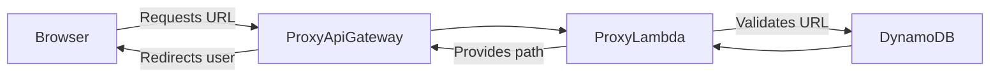
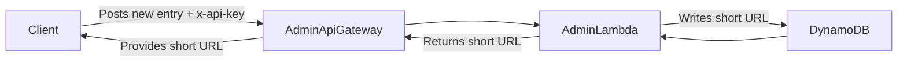

In the true spirit of Getting Shit Done™️ I thought I'd blog out here what the suggested architecture for my URL Shortening MVP! I'm mindful that any "enterprisey" solution for this kind of problem will address all manner of different scaleability constraints. However I have the luxury of time with my little solution, so am keen not to spend _too_ much time on premature optimisation!

With that in mind, my MVP should:

- Have sub-10-millisecond latency.
- Be Basically Free to run (AWS free tier only).
- Have an Api-key authenticated "Admin" api.
- Track number of hits to each URL.
- Allow folks to fork/template from the repo to stand up their own shortener within an hour.

With all those constraints in mind, I came up with the following architecture (thanks Mermaid and Hugo for the _ridiculously easy_ render hooks here!)

## Proxy Architecture

Here we've got a dead simple Serverless API example. This pattern of linking AWS Api Gateways with lambdas and having them run as a RESTful API is almost canonical at this point. So much so that the official AWS docs have a bunch of different patterns and frameworks that you can off-the-shelf to spin up in your own AWS account.

In this architecture:

- The browser makes a request using the shortened url.
- The "ProxyLambda" uses `DynamoDB` to validate the shortened url and:
  - Returns a 301 with the redirected URL (if found).
  - Returns a 301 with the configured default URL (if not).
  - Returns a 5XX if the lambda is misconfigured.

## Admin API Architecture

In a similar way to the "Proxy" architecture described above, here we have our `Admin Api Gateway` connected to our `Admin Lambda` which simply records the details of the entry in `DynamoDB` and returns the short URL.

In this architecture:

- The client makes a POST request with the long url and an api key (`x-api-key` header).
- The Admin Api Gateway validates the api key (no custom code to write here, yahoo!)
- The AdminLambda generates the short URL and uses DynamoDB to persist (or get!) the record.
- The short URL is then returned to the user.

## UI

For this MVP I decided that a management interface wasn't necessary! With the "Admin" API in place and the proxy working this is sufficient for me to hook up into my Hugo blogging workflow. The roadmap for this project certainly includes a sexy UI so you can manually create URLs and view things like usage statistics, but it was a conscious decision at this stage so that we can get something out there and start learning from it 🥳
